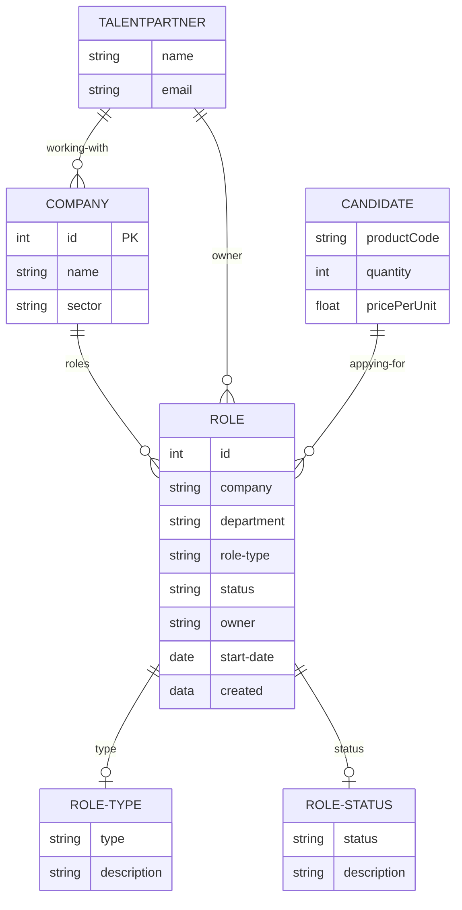

# london-hasura-meetup
Code from the London Hasura talent platform workshop

## Resources

### Retool app
https://getmissionctrl.retool.com/editor/Talent%20Lifecycle

### n8n

Code: https://github.com/getmissionctrl/hasrua-workshop-n8n

Railway: https://hasura-workshop-n8n.up.railway.app/workflow

### Hasura

Console: https://cloud.hasura.io/project/a8fb35d0-ea09-4b4f-9338-cc5c8bc75a90/console

Endpoint: https://hasura-workshop.missionctrl.dev/v1/graphql

### Schema

